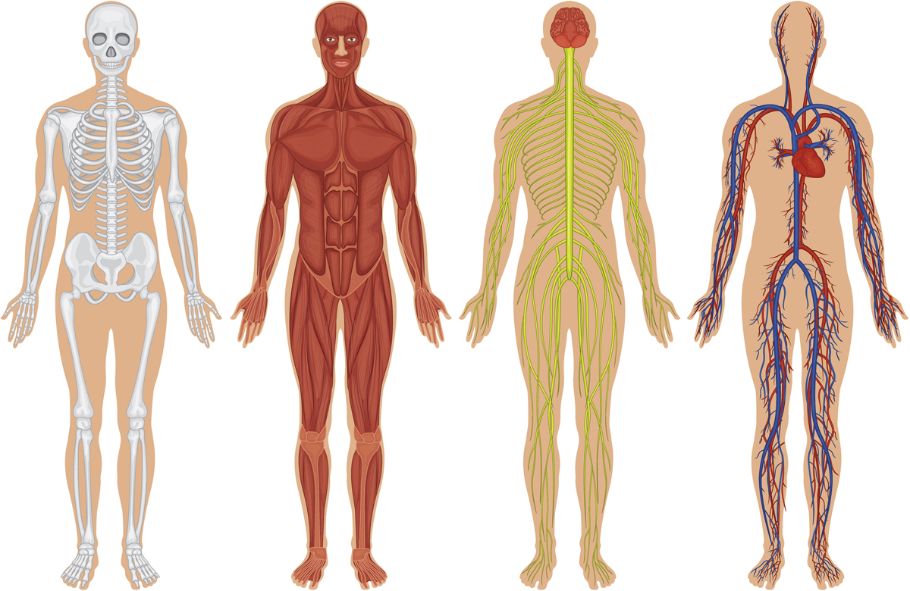
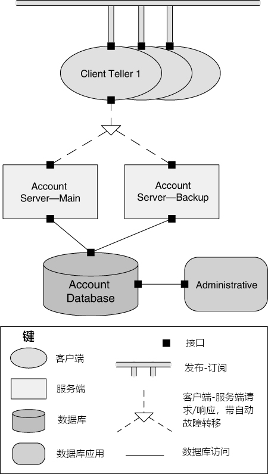
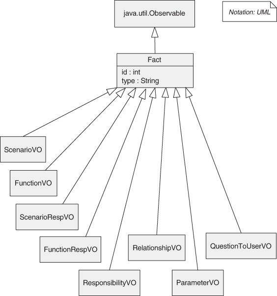

# 第1章 什么是软件架构？

> 我们应成为未来的架构师，而非受害者。
>
> —R. Buckminster Fuller 

我们（作者）撰写和你们（读者）阅读一本关于软件架构的书，这本书提炼了许多人的经验，这预先假定了以下两点：

1. 拥有合理的软件架构对软件系统的成功开发很重要。
2. 有足够的软件架构知识来写满一本书。

曾经有一段时间，这两个假设都需要证明其合理性。本书的早期版本试图说服读者这两个假设是正确的，并且一旦你被说服，就会为你提供基础知识，以便你自己能够应用架构实践。如今，对于这两个目标似乎没有什么争议了，所以这本书更多的是提供知识，而不是说服读者。

软件架构的基本原则是，每个软件系统的构建都是为了满足一个组织的业务目标，并且系统的架构是这些（通常是抽象的）业务目标和最终（具体的）成果系统之间的桥梁。虽然从抽象目标到具体系统的路径可能很复杂，但好消息是，可以使用已知的技术来设计、分析和记录软件架构，这些技术将有助于实现这些业务目标。这种复杂性是可以被驾驭的，是可以处理的。

那么，这些就是本书的主题：架构的设计、分析和文档记录。我们还将研究影响这些活动的因素，主要是以导致质量属性要求的业务目标的形式。

在本章中，我们将严格从软件 “工程” 的角度来关注架构。也就是说，我们将探讨软件架构给开发项目带来的价值。后面的章节将从业务和组织的角度进行探讨。

## 1.1. 软件架构是什么以及不是什么

软件架构有很多定义，通过网络搜索很容易找到，但我们喜欢的定义是：

> 一个系统的软件架构是一组用于对该系统进行推理所需的结构。这些结构包括：软件元素、它们之间的关系以及两者的属性。

这个定义与其他谈论系统 “早期”、“主要” 或 “重要” 决策的定义形成对比。虽然许多架构决策确实是早期做出的，但并非所有决策都是如此 —— 尤其是在敏捷和螺旋式开发项目中。同样，许多早期做出的决策也并非我们所认为的架构决策。而且，很难仅通过查看一个决策就判断它是否 “主要”。有时候只有时间才能证明。并且由于确定架构是架构师最重要的职责之一，我们需要知道架构由哪些决策组成。

相比之下，在软件中结构很容易识别，并且它们为系统设计和分析提供了强大的工具。

所以，定义就是这样：架构是关于支持推理的结构。

让我们看看这个定义的一些含义。

### 架构是一组软件结构

这是我们定义的第一个也是最明显的含义。结构只是由一种关系维系在一起的一组元素。软件系统由许多结构组成，没有单个结构可以声称是*唯一的*架构。结构可以分为不同的类别，而这些类别本身为思考架构提供了有用的方式。架构结构可以组织成三个有用的类别，它们将在架构的设计、文档记录和分析中发挥重要作用：

1. 组件和连接器结构
2. 模块结构
3. 分配结构

我们将在下一节中深入地探讨这些类型的结构。

虽然软件包含无穷无尽的结构，但并非所有结构都是架构性的。例如，包含字母 “z” 的源代码行集合，按照长度从最短到最长排序，是一种软件结构。但它不是一个很有趣的结构，也不是架构性的。如果一个结构支持对系统及其属性进行推理，那么它就是架构性的。这种推理应该是关于对系统的某些利益相关者来说重要的系统属性。这些属性包括系统实现的功能、系统在面对故障或被攻击时保持有效运行的能力、对系统进行特定更改的难易程度、系统对用户请求的响应能力等等。在本书中，我们将花费大量时间探讨架构与诸如此类的*质量属性*之间的关系。

因此，架构结构的集合既不是固定的也不是有限的。什么是架构性的取决于在你的系统上下文中对什么进行推理是有用的。

### 架构是一种抽象

由于架构由结构组成，而结构由元素 [^1] 和关系组成，所以架构包括软件元素以及这些元素之间的相互关系。这意味着架构特意且有目的地省略了关于元素的某些对系统推理无用的信息。因此，架构首先是对系统的一种*抽象*，它选择某些细节并抑制其他细节。在所有现代系统中，元素通过将元素的细节划分为公共部分和私有部分的接口相互作用。架构关注这个划分的公共方面；元素的私有细节 —— 仅与内部实现有关的细节 —— 不是架构性的。这种抽象对于驾驭架构的复杂性至关重要：我们根本无法也不想一直处理所有的复杂性。我们希望并且需要对系统架构的理解比理解该系统的每个细节容易几个数量级。你无法将即使是中等规模系统的每个细节都记在脑海中；架构的意义就在于让你不必这样做。

### 架构与设计

架构是设计，但并非所有设计都是架构。也就是说，许多设计决策不受架构的约束 —— 毕竟，它是一种抽象 —— 并且取决于下游设计师甚至实现者的判断力和良好决策。

### 每个软件系统都有软件架构

每个系统都有一个架构，因为每个系统都有元素和关系。然而，这并不意味着架构为任何人所知。也许设计系统的所有人都早已离开，文档已经消失（或者从未生成），源代码已经丢失（或者从未交付），而我们手头只有正在执行的二进制代码。这揭示了系统的架构与该架构的*表示*之间的区别。鉴于架构可以独立于其描述或规范而存在，这就提高了*架构文档记录*的重要性，这将在 [第 22 章][ch22] 中介绍。

### 并非所有架构都是好架构

我们的定义对于一个系统的架构是好是坏并不关心。一个架构可能支持也可能阻碍实现系统的重要需求。假设我们不接受试错作为为系统选择架构的最佳方法（即随机选择一个架构，基于它构建系统，然后不断修改并寄希望于最好的结果）这就提高了*架构设计*的重要性，这将在 [第 20 章][ch20] 中讨论，以及*架构评估*的重要性，这将在 [第 21 章][ch21] 中处理。

### 架构包含行为

每个元素的行为在有助于你对系统进行推理的范围内是架构的一部分。元素的行为体现了它们如何相互作用以及与环境作用。这显然是我们对架构定义的一部分，并且将对系统所表现出的属性产生影响，例如其运行时性能。

行为的某些方面不在架构师的关注层面。然而，在元素的行为影响整个系统的可接受性的程度上，这种行为必须被视为系统架构设计的一部分，并应如此进行文档记录。

> **系统架构与企业架构**
>
> 与软件架构相关的两个学科是系统架构和企业架构。这两个学科所关注的范围都比软件更广泛，并通过建立软件系统及其架构师必须遵循的约束条件来影响软件架构。
>
> ***系统架构***
>
> 系统的架构是对系统的一种表示，其中包括将功能映射到硬件和软件组件上、将软件架构映射到硬件架构上，以及关注人与这些组件的交互。也就是说，系统架构关注的是硬件、软件和人的整体。
>
> 例如，系统架构会影响分配给不同处理器的功能以及连接这些处理器的网络类型。软件架构将决定此功能是如何构建的以及驻留在各种处理器上的软件程序如何交互。
>
> 对软件架构映射到硬件和网络组件的描述，可以让人们对性能和可靠性等质量进行推理。对系统架构的描述将允许对功耗、重量和物理尺寸等其他质量进行推理。
>
> 在设计特定系统时，系统架构师和软件架构师之间经常就功能的分布进行协商，因此也会就对软件架构施加的约束进行协商。
>
> ***企业架构***
>
> 企业架构是对一个组织的流程、信息流、人员和组织子单元的结构和行为的描述。企业架构不一定包括计算机化的信息系统（显然，在计算机出现之前，组织就有符合上述定义的架构）但如今，除了最小型的企业外，没有信息系统支持的企业架构是不可想象的。因此，现代企业架构关注软件系统如何支持企业的业务流程和目标。通常，这一系列关注点中包括一个决定企业应该支持哪些具有何种功能的系统的过程。
>
> 例如，企业架构将指定各种系统用于交互的数据模型。它还将指定企业系统与外部系统交互的规则。
>
> 软件只是企业架构的一个关注点。人类如何使用软件来执行业务流程以及确定计算环境的标准是企业架构解决的另外两个常见关注点。
>
> 有时，支持系统之间以及与外部世界通信的软件基础设施被视为企业架构的一部分；在其他时候，这种基础设施被视为企业中的一个系统。（无论哪种情况，该基础设施的架构都是一个*软件*架构！）这两种观点将导致与基础设施相关的个人有不同的管理结构和影响范围。
>
> ***这些学科在本书的范围内吗？是！（好吧，也不是。）***
>
> 系统和企业为软件架构提供环境和约束。软件架构必须存在于系统和企业中，并且越来越成为实现组织业务目标的焦点。企业架构和系统架构与软件架构有很多共同之处。所有这些都可以进行设计、评估和记录；都要满足需求；都旨在满足利益相关者；都由结构组成，而结构又由元素和关系组成；在各自架构师的处理范围内都有一系列模式等等。因此，在这些架构与软件架构有共同之处的范围内，它们在本书的范围内。但是，像所有技术学科一样，每个学科都有自己的专业词汇和技术，我们不会涵盖这些内容。有大量其他资源可以涵盖这些内容。

## 1.2. 架构结构与视图

由于架构结构是我们对软件架构的定义和处理的核心，本节将更深入地探讨这些概念。在 [第 22 章][ch22] 中，我们将更深入地讨论这些概念，在那里我们将讨论架构文档。

架构结构在自然界中有对应物。例如，神经学家、骨科医生、血液学家和皮肤科医生对人体的各种结构都有不同的看法，如图 [1.1][ch01_fig01] 所示。眼科医生、心脏病专家和足病医生专注于特定的子系统。运动学家和精神病学家关注整个结构的行为的不同方面。尽管这些视图的描绘方式不同，并且具有非常不同的属性，但它们本质上都是相互关联和相互连接的：它们共同描述了人体的架构。

 **图1.1** 生理结构

架构结构在人类的努力中也有对应物。例如，电工、水管工、供暖和空调专家、屋顶工和框架工各自关注建筑物中的不同结构。你可以很容易地看到这些结构中每一个的重点品质。

软件也是如此。

### 三种结构类型

根据它们所展示的元素的广泛性质以及它们所支持的推理类型，架构结构可以分为三大类：

1. “**组件和连接器（C&C）结构**” 关注元素在运行时相互交互以执行系统功能的方式。它们描述了系统如何被构建为一组具有运行时行为（组件）和交互（连接器）的元素。组件是计算的主要单元，可以是服务、对等体、客户端、服务器、过滤器或许多其他类型的运行时元素。连接器是组件之间的通信工具，例如调用返回、进程同步运算符、管道或其他。C&C 结构有助于回答以下问题：

   - 主要的执行组件是什么，它们在运行时如何交互？
   - 主要的共享数据存储是什么？
   - 系统的哪些部分是重复的？
   - 数据如何在系统中流动？
   - 系统的哪些部分可以并行运行？
   - 系统的结构在执行时是否可以改变，如果可以，如何改变？

   由此推广，这些结构对于询问关于系统运行时属性（如性能、安全性、可用性等）的问题至关重要。

   C&C 结构是我们最常见的结构，但另外两类结构也很重要，不应被忽视。

   [图 1.2][ch01_fig02] 使用一种非正式的表示法展示了一个系统的 C&C 结构草图，图中的关键部分对其进行了解释。该系统包含一个由服务器和一个管理组件访问的共享存储库。一组客户端出纳员可以与账户服务器交互，并使用发布 - 订阅连接器在它们之间进行通信。

   

    **图1.2** 组件和连接器结构

2. “**模块结构**”将系统划分为实现单元，在本书中我们将其称为“模块”。模块结构展示了一个系统如何被构建为一组必须被构建或获取的代码或数据单元。模块被分配特定的计算职责，并且是编程团队工作分配的基础。在任何模块结构中，元素都是某种类型的模块（可能是类、包、层，或者仅仅是功能划分，所有这些都是实现单元）。模块代表了一种考虑系统的静态方式。模块被分配功能职责区域；在这些结构中，对所得到的软件在运行时如何表现的强调较少。模块实现包括包、类和层。模块结构中模块之间的关系包括使用、泛化（或“是一个”）和“是……的一部分”。[图 1.3][ch01_fig03]和[1.4][ch01_fig04]分别使用统一建模语言（UML）符号展示了模块元素和关系的示例。

   

    **图 1.3** UML 中的模块元素

   

    **图 1.4** UML 中的模块关系

   模块结构使我们能够回答以下问题：

   - 分配给每个模块的主要功能职责是什么？
   - 一个模块被允许使用哪些其他软件元素？
   - 它实际上使用和依赖哪些其他软件？
   - 哪些模块通过泛化或特化（即继承）关系与其他模块相关？

   模块结构直接传达了这些信息，但它们也可以用于回答当分配给每个模块的职责发生变化时对系统的影响问题。因此，模块结构是推理系统可修改性的主要工具。

3. “**分配结构**” 建立了从软件结构到系统的非软件结构（如组织、开发、测试和执行环境）的映射。分配结构回答以下问题：

   - 每个软件元素在哪个处理器上执行？
   - 在开发、测试和系统构建期间，每个元素存储在哪个目录或文件中？
   - 每个软件元素分配给哪个开发团队？

### 一些有用的模块结构

有用的模块结构包括：

- “**分解结构**”。单元是通过 “是…… 的子模块” 关系相互关联的模块，展示了模块如何递归地分解为更小的模块，直到模块小到足以容易理解为止。在此结构中的模块代表了设计的一个常见起点，因为架构师列举了软件单元必须要做的事情，并将每个项目分配给一个模块以进行后续（更详细的）设计和最终实现。模块通常与产品（如接口规范、代码和测试计划）相关联。分解结构在很大程度上决定了系统的可修改性。也就是说，变化是否在少数（最好是小的）模块的权限范围内？这种结构通常用作开发项目组织的基础，包括文档结构以及项目的集成和测试计划。[图 1.5][ch01_fig05] 展示了一个分解结构的示例。

  

   **图1.5** 分解结构

- “**使用结构**”。在这个重要但经常被忽视的结构中，单元也是模块，可能还有类。这些单元通过“使用”关系相互关联，这是一种特殊形式的依赖关系。如果一个软件单元的正确性需要另一个单元的正确运行版本（而不是一个桩）存在，那么第一个单元就使用了第二个单元。使用结构用于设计可以扩展以添加功能的系统，或者可以从中提取有用的功能子集。能够轻松创建系统的子集允许进行增量开发。这种结构也是衡量社会债务（实际发生的而不仅仅是应该发生的团队之间的沟通量）的基础，因为它定义了哪些团队应该相互交流。[图 1.6][ch01_fig06]展示了一个使用结构，并突出显示了如果模块`admin.client`存在，则在增量中必须存在的模块。

  

   **图1.6** 使用结构

- “**层结构**”。此结构中的模块称为层。一个层是一个抽象的“虚拟机”，它通过一个受管理的接口提供一组内聚的服务。层可以以受管理的方式使用其他层；在严格分层的系统中，一个层只允许使用一个其他层。这种结构赋予系统可移植性，即改变底层虚拟机的能力。[图 1.7][ch01_fig07] 展示了 UNIX System V 操作系统的层结构。

  

   **图 1.7** 分层结构

- “**类（或泛化）结构**”。此结构中的模块称为类，它们通过“继承自”或“是……的实例”关系相互关联。这种视图支持对具有相似行为或能力的集合以及参数化差异进行推理。类结构允许人们对复用和功能的增量添加进行推理。如果遵循面向对象分析和设计过程的项目存在任何文档，通常就是这种结构。[图 1.8][ch01_fig08]展示了一个来自架构专家工具的泛化结构。

  

   **图1.8** 泛化结构

- “**数据模型**”。数据模型从数据实体及其关系方面描述静态信息结构。例如，在银行系统中，实体通常包括账户、客户和贷款。账户有几个属性，如账号、类型（储蓄或支票）、状态和当前余额。一种关系可能规定一个客户可以有一个或多个账户，并且一个账户与一个或多个客户相关联。[图 1.9][ch01_fig09] 展示了一个数据模型的示例。

 **图1.9** 数据模型

### 一些有用的组件和连接器（C&C）结构

C&C 结构展示了系统的运行时视图。在这些结构中，刚才描述的模块都已被编译为可执行形式。因此，所有 C&C 结构都与基于模块的结构正交，并处理正在运行的系统的动态方面。例如，一个代码单元（模块）可以被编译为一个在执行环境中被复制数千次的服务。或者 1000 个模块可以被编译并链接在一起以生成一个单一的运行时可执行文件（组件）。

在所有 C&C 结构中的关系是 “连接”，展示了组件和连接器是如何连接在一起的。（连接器本身可以是熟悉的构造，如 “调用”。）有用的 C&C 结构包括：

- “服务结构”。这里的单元是通过服务协调机制（如消息）进行交互操作的服务。服务结构是帮助设计由可能彼此独立开发的组件组成的系统的重要结构。
- “并发结构”。这种 C&C 结构允许架构师确定并行的机会以及可能发生资源争用的位置。单元是组件，连接器是它们的通信机制。组件被排列成 “逻辑线程”。逻辑线程是一系列计算，可以在设计过程的后期分配到单独的物理线程中。并发结构在设计过程的早期用于识别和管理与并发执行相关的问题。

### 一些有用的分配结构

分配结构定义了 C&C 或模块结构中的元素如何映射到非软件的事物上 —— 通常是硬件（可能是虚拟化的）、团队和文件系统。有用的分配结构包括：

- “部署结构”。部署结构展示了软件如何分配到硬件处理和通信元素上。元素是软件元素（通常是 C&C 结构中的一个进程）、硬件实体（处理器）和通信路径。关系是 “分配到”，展示了软件元素驻留在哪个物理单元上，如果分配是动态的，还有 “迁移到”。这种结构可用于推理性能、数据完整性、安全性和可用性。它在分布式系统中特别受关注，并且是实现可部署性质量属性（见 [第 5 章][ch05]）所涉及的关键结构。[图 1.10][ch01_fig10] 以 UML 展示了一个简单的部署结构。

  

   **图1.10** 部署结构

- “**实现结构**”。这种结构展示了软件元素（通常是模块）如何映射到系统的开发、集成、测试或配置控制环境中的文件结构。这对于管理开发活动和构建过程至关重要。

- “**工作分配结构**”。这种结构将实现和集成模块的责任分配给将执行这些任务的团队。将工作分配结构作为架构的一部分，明确了关于谁来做这项工作的决定具有架构以及管理方面的影响。架构师将了解每个团队所需的专业知识。例如，亚马逊决定为其每个微服务分配一个单独的团队，这是关于其工作分配结构的一种声明。在大型开发项目中，确定功能共性的单元并将其分配给一个团队，而不是让每个需要它们的人都去实现它们，这是很有用的。这种结构还将确定团队之间的主要沟通途径：定期网络会议、维基、电子邮件列表等等。

[表 1.1][ch01_tab01] 总结了这些结构。它列出了每种结构中元素和关系的含义，并说明了每种结构可能的用途。

**表1.1** 有用的架构结构

|                           | 软件结构           | 元素类型                      | 关系                                                         | 适用于                                                       | 受影响的质量关注点                                         |
| :------------------------ | :----------------- | :---------------------------- | :----------------------------------------------------------- | :----------------------------------------------------------- | :--------------------------------------------------------- |
| **模块结构**              | 分解               | 模块                          | 是……的子模块                                                 | 资源分配以及项目结构规划；封装。                             | 可修改性                                                   |
|                           | Uses               | 模块                          | 使用（即需要正确存在）。                                     | 设计子集和扩展。                                             | “可子集化”、可扩展性。                                     |
|                           | 分层               | 层                            | 被允许使用……的服务；提供抽象。                               | 增量开发；在“虚拟机”之上实现系统。                           | 可移植性、可修改性                                         |
|                           | 类                 | 类、对象                      | 是……的一个实例；是……的一种泛化。                             | 在面向对象系统中，提取共性；规划功能扩展。                   | 可修改性、可扩展性                                         |
|                           | 数据模型           | 数据实体                      | {一，多}-对-{一，多}；泛化；特化。                           | 设计全局数据结构以实现一致性和性能。                         | 可修改性、性能                                             |
| **C&C结构**               | 服务               | 服务，服务注册                | 连接（通过消息传递）。                                       | 调度分析；性能分析；健壮性分析。                             | 互操作性、可用性、可修改性                                 |
|                           | 并发               | 进程、线程                    | 连接（通过通信和同步机制）。                                 | 确定资源竞争存在的位置以及并行的机会。                       | 性能                                                       |
| **分配结构**              | 部署               | 组件、硬件元素                | “分配到”；“迁移到”。                                         | 将软件元素映射到系统元素。                                   | 性能、安全性、能源、可用性、可部署性                       |
|                           | 实现               | 模块、文件结构                | 储存于                                                       | 配置控制、集成、测试活动                                     | 开发效率                                                   |
|                           | 工作分配           | 模块、组织单位                | 分配给                                                       | 项目管理、专业知识和可用资源的最佳利用、共性管理。           | 开发效率                                                   |

### 结构之间的关联

这些结构中的每一个都为系统提供了不同的视角和设计抓手，并且每一个结构本身都是有效且有用的。尽管这些结构给出了不同的系统视角，但它们并非相互独立。一个结构中的元素将与其他结构中的元素相关联，我们需要对这些关系进行推理。例如，分解结构中的一个模块在某个 C&C（组件和连接器）结构中可能表现为一个组件、一个组件的一部分或几个组件，反映了它在运行时的对应物。一般来说，结构之间的映射是多对多的。

[图 1.11][ch01_fig11] 展示了两个结构如何相互关联的一个简单示例。左边的图像展示了一个小型客户端 - 服务器系统的模块分解视图。在这个系统中，必须实现两个模块：客户端软件和服务器软件。右边的图像展示了同一系统的 C&C 视图。在运行时，有十个客户端正在运行并访问服务器。因此，这个小系统有两个模块和十一个组件（以及十个连接器）。

 **图 1.11** 客户端-服务器系统的两种视图

虽然分解结构中的元素与客户端 - 服务器结构之间的对应关系很明显，但这两种视图用于非常不同的目的。例如，右边的视图可用于性能分析、瓶颈预测和网络流量管理，而使用左边的视图来做这些事情则极其困难或不可能。（在 [第 9 章][ch09] 中，我们将学习 Map-Reduce 模式，在该模式中，简单、相同功能的副本分布在数百或数千个处理节点上 —— 对于整个系统是一个模块，但每个节点是一个组件。）

个别项目有时会认为一种结构是主导的，并在可能的情况下根据主导结构来塑造其他结构。通常，主导结构是模块分解结构，这是有充分理由的：它往往会衍生出项目结构，因为它反映了开发团队的结构。在其他项目中，主导结构可能是一个 C&C 结构，该结构展示了系统的功能和（或）关键质量属性在运行时是如何实现的。

### 越少越好

并非所有系统都需要考虑许多架构结构。系统越大，这些结构之间的差异往往就越显著；但对于小型系统，我们通常可以用较少的结构来应对。例如，通常只需要一个 C&C 结构就可以了，而不是使用多个。如果只有一个进程，那么进程结构就会缩减为一个节点，并且在设计中无需明确表示。如果不会进行分布（即如果系统在单个处理器上实现），那么部署结构就很简单，无需进一步考虑。一般来说，只有在这样做能带来积极的投资回报（通常是降低开发或维护成本）时，才应该设计和记录一个结构。

### 选择哪些结构？

我们简要介绍了许多有用的架构结构，当然还有更多可能的结构。架构师应该选择哪些结构进行处理？架构师应该选择哪些结构进行记录？肯定不是所有的结构。一个好的答案是，你应该考虑可用的各种结构如何为系统最重要的质量属性提供洞察力和影响力，然后选择在实现这些属性方面发挥最佳作用的结构。

### 架构模式

在某些情况下，架构元素以解决特定问题的方式组合在一起。随着时间的推移和在许多不同领域中，这些组合被发现是有用的，因此它们被记录和传播。这些架构元素的组合为解决系统面临的一些问题提供了打包的策略，被称为模式。本书的 [第二部分][part02] 将详细讨论架构模式。

## 1.3. 什么造就了 “良好” 的架构？

并不存在本质上绝对好或坏的架构。架构只是对于某些目的而言更合适或不太合适。一个三层分层的面向服务架构可能非常适合大型企业的基于网络的 B2B 系统，但对于航空电子应用来说可能完全错误。为实现高可修改性而精心设计的架构对于一次性原型来说没有意义（反之亦然！）。本书要传达的一个信息是，实际上架构是可以被 “评估” 的（关注架构的一大好处就是如此）但这种评估只有在特定明确目标的背景下才有意义。

然而，在设计大多数架构时应遵循一些经验法则。不应用这些准则中的任何一条并不一定意味着架构会有致命缺陷，但至少它应该作为一个需要调查的警告信号。这些规则可以积极地应用于全新开发，以帮助正确地构建系统。或者它们可以作为分析启发式方法应用，以了解现有系统中的潜在问题区域并指导其演进方向。

我们将观察结果分为两类：过程建议和产品（或结构）建议。我们的过程建议如下：

1. 软件（或系统）架构应该是由一位架构师或一小群有明确技术领导的架构师的产物。这种方法对于赋予架构概念完整性和技术一致性非常重要。这个建议适用于敏捷和开源项目以及 “传统” 项目。架构师和开发团队之间应该有紧密的联系，以避免出现 “象牙塔” 式不切实际的设计。
2. 架构师（或架构团队）应该持续地将架构建立在明确优先级的、具体规定的质量属性需求列表之上。这些将为始终存在的权衡提供依据。功能的重要性相对较低。
3. 架构应该使用 “视图” 进行记录。（视图只是一个或多个架构结构的表示。）视图应解决最重要的利益相关者的关注点，以支持项目时间表。这可能意味着一开始文档最少，然后在以后逐步详细阐述。关注点通常与系统的构建、分析和维护以及新利益相关者的教育有关。
4. 应该评估架构实现系统重要质量属性的能力。这应该在生命周期的早期进行，此时能获得最大的收益，并在适当的时候重复进行，以确保架构的变化（或其预期的环境变化）没有使设计过时。
5. 架构应该适合增量实现，以避免必须一次性集成所有内容（这几乎从来都不起作用），并尽早发现问题。一种方法是通过创建一个 “骨架” 系统，在其中测试通信路径，但一开始功能最少。这个骨架系统可以用来逐步 “生长” 系统，并在必要时进行重构。

我们的结构经验法则如下：

1. 架构应该具有定义良好的模块，其功能职责按照信息隐藏和关注点分离的原则进行分配。信息隐藏模块应该封装可能发生变化的内容，从而使软件免受这些变化的影响。每个模块都应该有一个定义良好的接口，该接口将可变方面从使用其功能的其他软件中封装或 “隐藏” 起来。这些接口应该允许各自的开发团队在很大程度上独立工作。
2. 除非你的需求是前所未有的 —— 有可能，但不太可能 —— 你的质量属性应该通过使用针对每个属性的众所周知的架构模式和策略（在 [第 4 章][ch04] 至 [第 13 章][ch13] 中描述）来实现。
3. 架构永远不应该依赖于商业产品或工具的特定版本。如果必须依赖，它应该被构建成使得切换到不同版本是直接且成本低廉的。
4. 产生数据的模块应该与消费数据的模块分开。这往往会增加可修改性，因为变化通常局限于数据的生产方或消费方。如果添加了新数据，双方都必须改变，但这种分离允许分阶段（增量）升级。
5. 不要期望模块和组件之间有一一对应的关系。例如，在具有并发的系统中，一个组件的多个实例可能并行运行，其中每个组件都是由同一个模块构建的。对于具有多个并发线程的系统，每个线程可能使用来自几个组件的服务，每个组件都是由不同的模块构建的。
6. 每个进程都应该被编写成可以轻松地改变其分配到特定处理器的方式，甚至可能在运行时进行改变。正如我们将在 [第 16 章][ch16] 和 [第 17 章][ch17] 中讨论的，这是虚拟化和云部署日益增长趋势的一个驱动力。
7. 架构应该具有少量简单的组件交互模式。也就是说，系统应该在整个过程中以相同的方式做相同的事情。这种做法将有助于提高可理解性、减少开发时间、增加可靠性并增强可修改性。
8. 架构应该包含一小组特定（且数量少）的资源竞争区域，其解决方案应明确规定并得到维护。例如，如果网络利用率是一个关注领域，架构师应该为每个开发团队制定（并强制执行）将导致可接受网络流量水平的指南。如果性能是一个关注点，架构师应该制定（并强制执行）时间预算。

## 1.4. 小结

系统的软件架构是用于对该系统进行推理所需要的一组结构。这些结构由软件元素、它们之间的关系以及两者的属性构成。

结构分为三类：

- 模块结构将系统展示为一组需要构建或获取的代码或数据单元。
- 组件与连接器结构将系统展示为一组具有运行时行为（组件）和交互（连接器）的元素。
- 分配结构展示了来自模块结构和组件与连接器结构的元素如何与非软件结构（如 CPU、文件系统、网络和开发团队）相关联。

结构代表了架构的主要工程着力点。每种结构都具备操控一个或多个质量属性的能力。总体而言，这些结构代表了一种创建架构（以及随后对其进行分析并向利益相关者解释）的有力方法。并且，正如我们将在 [第 22 章][ch22] 中看到的，架构师选作工程着力点的结构也是选择作为架构文档编制基础的主要候选对象。

每个系统都有软件架构，但这种架构可能有文档记录并传播，也可能没有。

不存在本质上绝对好或坏的架构。架构只是对于某些目的而言更合适或不太合适。

## 1.5. 扩展阅读

如果你对软件架构这一研究领域有着浓厚的兴趣，那么你可能会有兴趣阅读一些开创性的著作。其中大部分根本没有提及 “软件架构” 这个词，因为这个短语直到 20 世纪 90 年代中期才出现，所以你得从字里行间去领会其含义。

艾兹格・迪科斯彻（Edsger Dijkstra）1968 年关于 T.H.E. 操作系统的论文引入了分层的概念 [[Dijkstra 68][dijkstra_68]]。大卫・帕纳斯（David Parnas）的早期著作奠定了许多概念基础，包括信息隐藏 [[Parnas 72][parnas_72]]、程序族 [[Parnas 76][parnas_76]]、软件系统固有的结构 [[Parnas 74][parnas_74]] 以及利用结构构建系统的子集和超集 [[Parnas 79][parnas_79]]。帕纳斯的所有论文都可以在更容易获取的他的重要论文集 [[Hoffman 00][hoffman_00]] 中找到。现代分布式系统的存在得益于协作顺序进程的概念，在这方面（以及其他方面），C. A. R.（托尼）・霍尔（Sir C. A. R. (Tony) Hoare）在概念化和定义方面起到了重要作用 [[Hoare 85][hoare_85]]。

1972 年，迪科斯彻、霍尔以及奥利 - 约翰・达尔（Ole-Johan Dahl）认为，程序应该被分解成具有小型且简单接口的独立组件。他们将自己的方法称为结构化编程，但可以说这就是软件架构的首次亮相 [[Dijkstra 72][dijkstra_72]]。

玛丽・肖（Mary Shaw）和大卫・加兰（David Garlan）两人合作以及各自独立完成了大量的工作，这些工作帮助创建了我们称之为软件架构的研究领域。他们确立了该领域的一些基本原则，并且除其他事项外，还对一系列具有开创性的架构风格（一个与模式类似的概念）进行了分类，其中几种在本章中作为架构结构呈现。可以先从 [[Garlan 95][garlan_95]] 开始阅读。

软件架构模式在《面向模式的软件架构》（*Pattern-Oriented Software Architecture*）系列丛书 [布施曼 96 及其他作者] 中已有广泛的分类。在本书的 [第二部分][part02] 中我们也会通篇讨论架构模式。

关于工业开发项目中所使用的架构视图的早期论文有 [[Soni 95][soni_95]] 和 [[Kruchten 95][kruchten_95]]。前者发展成了一本书 [[Hofmeister 00][hofmeister_00]]，该书全面展示了在开发和分析中使用视图的情况。

许多书籍都聚焦于与架构相关的实际实现问题，比如乔治・费尔班克斯（George Fairbanks）的《恰到好处的软件架构》（*Just Enough Software Architecture*）[[Fairbanks 10][fairbanks_10]]、伍兹（Woods）和罗赞斯基（Rozanski）的《软件系统架构》（*Software Systems Architecture*）[[Woods 11][woods_11]] 以及马丁（Martin）的《整洁架构：软件结构与设计的工匠指南》（*Clean Architecture: A Craftsman’s Guide to Software Structure and Design*）[[Martin 17][martin_17]]。

## 1.6. 问题讨论

**1.** 你是否熟悉软件架构的不同定义？如果是，将其与本章给出的定义进行比较和对比。许多定义包含诸如 “基本原理”（说明架构之所以如此的原因）或架构如何随时间演变等考虑因素。你是否同意这些考虑因素应成为软件架构定义的一部分？

**2.** 讨论架构如何作为分析的基础。那么在决策方面呢？架构能支持哪些类型的决策？

**3.** 架构在降低项目风险方面的作用是什么？

**4.** 找到一个普遍接受的 “系统架构” 定义，并讨论它与软件架构的共同之处。对 “企业架构” 也做同样的分析。

**5.** 找到一个已发布的软件架构示例。展示了哪些结构？根据其目的，本应展示哪些结构？该架构支持哪些分析？对其进行评论：你有哪些该表示例没有回答的问题？

**6.** 帆船有架构，这意味着它们有 “结构”，可用于对船舶的性能和其他质量属性进行推理。查找 “三桅帆船”、“双桅横帆船”、“独桅纵帆船”、“护卫舰”、“双桅纵帆船”、“纵帆船” 和 “单桅帆船” 的技术定义。提出一套用于区分和推理船舶架构的有用 “结构”。

**7.** 飞机有其架构，其特点可以通过它们如何解决一些主要设计问题来体现，例如发动机位置、机翼位置、起落架布局等等。几十年来，大多数为客运设计的喷气式飞机都具有以下特征：

- 发动机安装在机翼下方的吊舱中（而非内置在机翼中或安装在机身尾部）；
- 机翼在机身底部与机身相连（而非在顶部或中部）。

首先，在网上搜索，从波音、巴西航空工业公司、图波列夫和庞巴迪等每个制造商中找到这种设计类型的一个示例和一个反例。接下来，进行一些在线研究并回答以下问题：这种设计为飞机提供了哪些重要的品质？

------

[^1]: 在本书中，当我们提到模块（module）或者组件（component），并且不想对两者加以区分时，我们会使用 “元素（element）” 这个术语。

------

[ch01_fig01]: ch01.md#ch01_fig01
[ch01_fig02]: ch01.md#ch01_fig02
[ch01_fig03]: ch01.md#ch01_fig03
[ch01_fig04]: ch01.md#ch01_fig04
[ch01_fig05]: ch01.md#ch01_fig05
[ch01_fig06]: ch01.md#ch01_fig06
[ch01_fig07]: ch01.md#ch01_fig07
[ch01_fig08]: ch01.md#ch01_fig08
[ch01_fig09]: ch01.md#ch01_fig09
[ch01_fig10]: ch01.md#ch01_fig10
[ch01_fig11]: ch01.md#ch01_fig11

[ch01_tab01]: ch01.md#ch01_tab01

[part02]: part02.md

[ch04]: ch04.md
[ch05]: ch05.md
[ch09]: ch09.md
[ch13]: ch13.md
[ch16]: ch16.md
[ch17]: ch17.md
[ch20]: ch20.md
[ch21]: ch21.md
[ch22]: ch22.md

[dijkstra_68]: ref01.md#ref_77
[dijkstra_72]: ref01.md#ref_78
[garlan_95]: ref01.md#ref_99
[hoare_85]: ref01.md#ref_112
[hoffman_00]: ref01.md#ref_113
[parnas_72]: ref01.md#ref_204
[parnas_74]: ref01.md#ref_205
[parnas_76]: ref01.md#ref_206
[parnas_79]: ref01.md#ref_207
[soni_95]: ref01.md#ref_232
[kruchten_95]: ref01.md#ref_151
[hofmeister_00]: ref01.md#ref_114
[fairbanks_10]: ref01.md#ref_85
[woods_11]: ref01.md#ref_255
[martin_17]: ref01.md#ref_174

